# Covid Research Project

## Overview 
### Topic and Hypothesis 
## Topic and Hypothesis 
There is plenty of argument in the US (and world) for and against mask mandate and vaccine mandate. Here we want to quantify if mask mandates, and COVID-19 vaccine are effective tools in fight against COVID-19. There are plenty of data available on mandates, vaccination rate, hospitalization, and covid related deaths. Here, our team will analyze following hypothesis. 

H01: Mask mandate does nothing to prevent COVID-19 transmission.  
HA1: Mask mandate does prevent COVID-19 transmission.  
H02.1: Vaccination does not prevent COVID-19 transmission.  
HA2.2: Vaccination helps prevent COVID-19 transmission.  
H02.2: Vaccination does not reduce hospitalization.  
HA2.2: Vaccination helps reduce hospitalization.  
H02.3: Vaccination does not reduce death rates.  
HA2.3: Vaccination does reduce death rates.  

 ### Data Sources 
The two sources we have picked are:

https://covidactnow.org/data-api

https://www.littler.com/publication-press/publication/facing-your-face-mask-duties-list-statewide-orders

The COVID act now data API contains information about all states' vaccination numbers. Ratio of vaccines to the population as well as number of vaccines administered. The team will create a database that would have information from above sources and run report sorted by states overall performance on different factors. 

We will be using data from March 01, 2021 to February 28, 2022 and analyze trend over a year. 

## Team and Roles 
There are four members in our team: 
##### Connor Cole: 
Connor is playing role of the square where he will be will be responsible for the repository.

##### Adibayo Ajibosin 
Adibayo is playing role of the triangle who will create mockup of machine learning model.
##### Hammad Rahman
Hammad is the circle of the team where he will be working with database and dataset  
##### Aayam Shrestha 
Aayam is the X and in charge of technologies decisions. 
### Communication Protocol 
We are using following communication methods 
Slack is for note taking and communicating to team members and also providing minutes to people who missed the Zoom meetings. 
Zoom: Zoom is to hold meetings and share screens for live collaboration. The meetings are not recorded however minutes are posted on slack.   
Github: Github is store work and so we can submit our work and combine branches. 
Phone and Text: If we need to communicate urgently and tell everyone something that cannot wait for them to be in front of a computer.   

## Machine Learning Model 
Our model is to show 
(Y) Number of cases = 1/(X) vaccines completed ratio to state population.

## Project Outline 
### ETL
#### Extract: 
We extracted data from multiple sources listed in data source and saved it to CSV format with the help of Jupyter notebook. The tools used in this stage was Python and Pandas. We used mainly Python and Pandas to drop irrelevant data and clean up dataframe till what we had was extracted dataframe with relevant data. Then data was loaded into Postgres SQL hosted on AWS RDS. There were four input tables.  
            1. Main Table: This table was created by an API from littler.com which had most data about our four hypotheses. We extracted infection rate per day, new deaths per day, vaccination rate per state, and hospitalization rate per day.  
            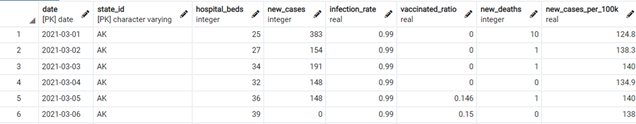  
            2. Input mandate: This table has data on mask mandate by states by months.  
            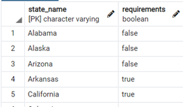
            3. Input Population: This table has population by states.  
            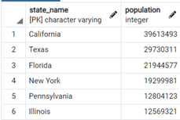 
            4. Input State_id: One of our tables has state abbreviation while others has state name. Therefore, we added a table to translate state name in to state code (example Alska to AK).  
            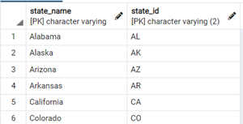  
#### Tranform: 
Then data was transformed to fit into four transformed tables that helps transform into tables that could be analyzed by machine learning and Tableau.  
            1. Mask mandate: This table has state id, date, infection rate, and mask requirements. The purpose of this table is to analyze H01: Mask mandate does nothing to prevent COVID-19 transmission. 
            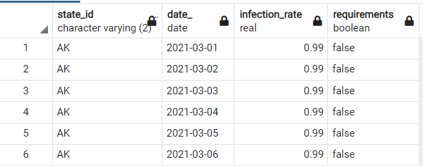
            2. Infection Rate: This table has state id, date, new cases, vaccination ratio, and state population. The purpose of this table was to analyze H0: Vaccination does not prevent COVID-19 transmission. 
            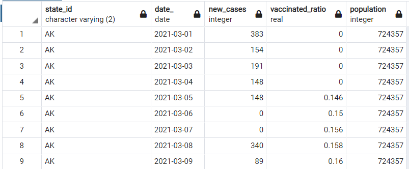
            3. Hospitalization: This table has State_id, date, number of hospital beds occupied, vaccination_ratio, and state population. The purpose of this table was to analyze H0: Vaccination does not prevent COVID-19 hospitalization. 
            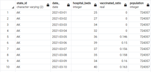
            4.New Deaths: his table has State_id, date, number of deaths per day, vaccination_ratio, and state population. The purpose of this table was to analyze H0: Vaccination does not prevent COVID-19 deaths. 
            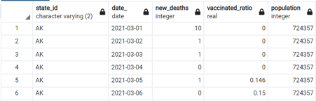
Furthermore, these output tables were converted into CSV and using excel further tranform to grouped data firest by state then by months and uploaded to tableau to be analyzed. The original CSV were also used in machine learning to be analyzed. Results are below. 
## Results. 
### Tableau
Tableau dashboared can be found below.  

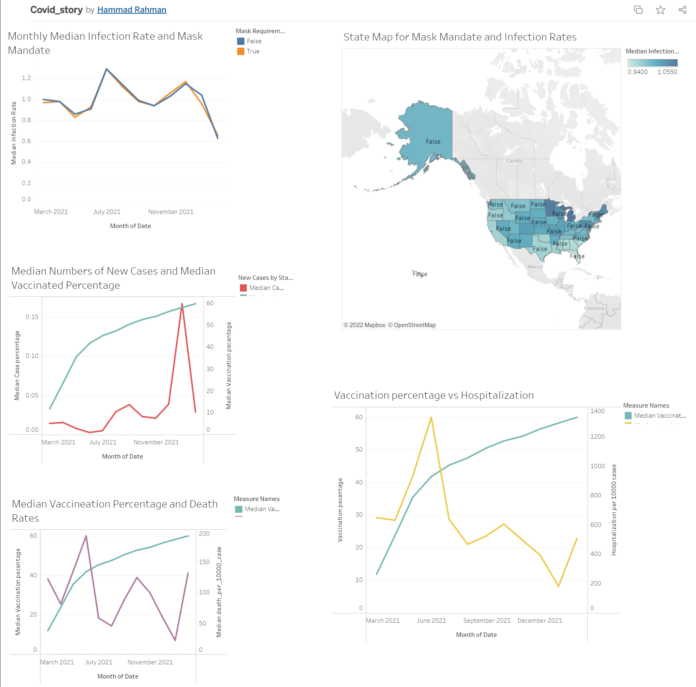
[Tableau Link for Dashboard](https://public.tableau.com/shared/XFDG3XJ73?:display_count=n&:origin=viz_share_link){:target="_blank"}

#### H01: Mask mandate does nothing to prevent COVID-19 transmission.
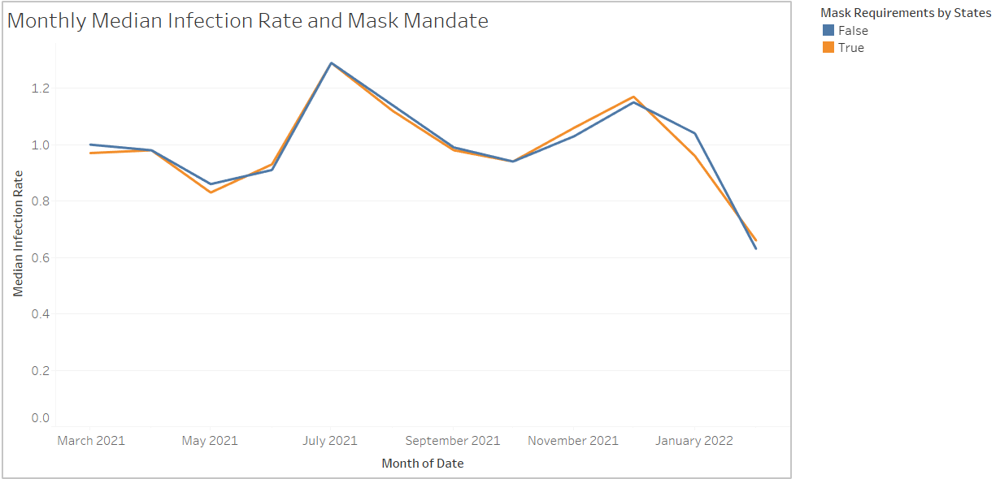  
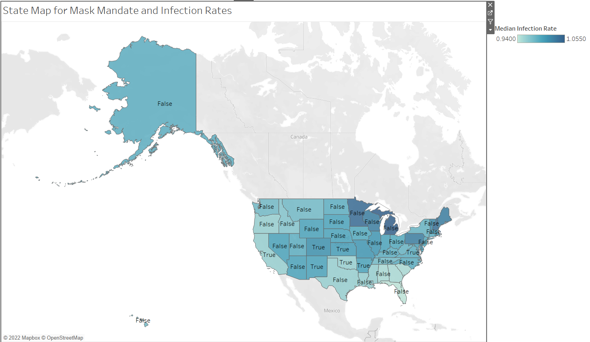
From this graph and the map we can see that this data fails to reject null hypothesis. The correlation between masked mandate state and no mandate state is so strong that it is safe to assume that the rate of infection was affected by anything but the mandate. This is the only hypothesis where we are certain about our results 

However, just to clear that this is an analysis of mask mandate and not masking itself. We did not analyze data of people who wear mask or people who do not wear masks. 

#### H02.1: Vaccination does not prevent COVID-19 transmission.
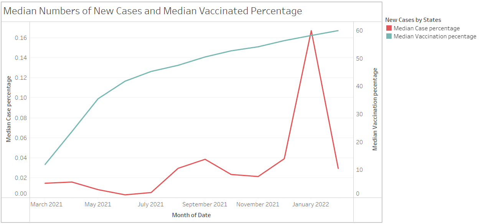
There seems to be no correlation between new cases of COVID-19 and vaccination rate. Therefore, we failed to reject null hypothesis. However, this could be further studied with machine learning and big data tools. 

#### H02.2: Vaccination does not reduce hospitalization.
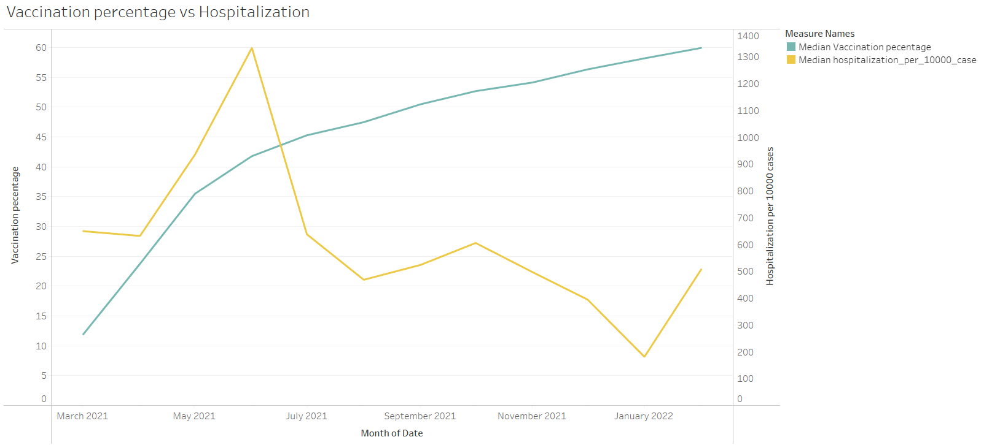
There is an inverse correlation between vaccination ratio and hospitalization bed utlization. Therefore, we reject null hypothesis. Vaccination does seem to be reducing hospitalization. 

#### H02.3: Vaccination does not reduce death rates.
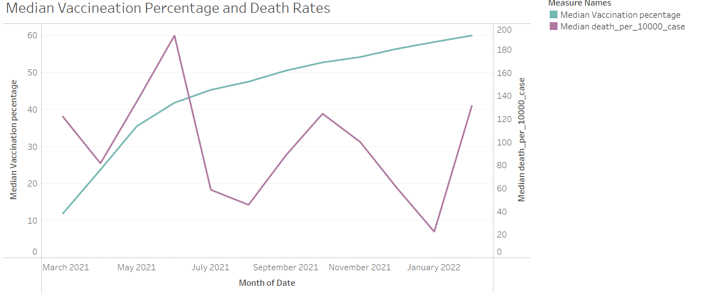
It may not look clear but death rates has been declining as vaccine rate is going up. However, more analysis is needed before we could reject null hypotheis. Here we failed to reject null hypothesis as there is no clear evidence to support that vaccine is reducing the death rate. 

### Machine Learning

#### H01: Mask mandate does nothing to prevent COVID-19 transmission.

#### H02.1: Vaccination does not prevent COVID-19 transmission.

#### H02.2: Vaccination does not reduce hospitalization.

#### H02.3: Vaccination does not reduce death rates.

## Presnetations
### Google Slides Presentation
https://docs.google.com/presentation/d/1iJsyCX3Ue4k_nVe7nkrCchj5CML6APWzz7dHxmCkNDc/edit#slide=id.g35f391192_00

### Tableau Dashboard
https://public.tableau.com/app/profile/hammad.rahman/viz/Covid_story_16492861766870/Dashboard1?publish=yes

## Limitations
1. Experience: This is a major undertaking by a bunch of students who have barely scratch the surface of data science. There is lot more time and lot more data needed to be analyzed before we could be certain about our analysis. Three out of four of our hypotheses we are uncertain because we did not have enough time and expertise to come to conclusive results.  
2. Resources: Covid-19 is still a new epidemic with new variants, new vaccines, new outbreaks, and new laws affecting total numbers month by month basis. We did not have expertise or resources to analyze and each one of those variables to ensure exceptional results.   
3. Time: time window was short and all analysts have full time jobs and other commitments. It was quite difficult to keep everyone on same page and gets deliverables sorted.   

